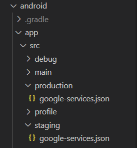

# multienvironmentseparating
Separating multi- environment with firebase

commands
- flutter run --flavor staging
- flutter run --flavor production
- flutter build apk --flavor staging
- flutter build apk --flavor production
- flutter build apk --split-per-abi --flavor staging
- flutter build apk --split-per-abi --flavor production
- flutter build appbundle --flavor staging
- flutter build appbundle --flavor production

Separating 
- [Lab: separating multi environment medium](https://medium.com/@matt.goodson.business/separating-build-environment-configurations-in-flutter-with-firebase-doing-it-the-right-way-c72c3ad3621f)
     
Android 
---------

1. Go to android/app/src/ 
   Create two Folder "production and staging"

2. Go to firebase console and also create 2 project for staging and production.
   Download google-services.json 




3. In main.dart , call Method flavor

```
void main() async {
  WidgetsFlutterBinding.ensureInitialized();
  await getMethodChannel();  // call in main
  runApp(const MyApp());
}

Future<void> getMethodChannel() {
  return const MethodChannel('flavor')
      .invokeMethod<String>('getFlavor')
      .then((String? flavor) {
    print('STARTED WITH FLAVOR $flavor');
    if (flavor == 'production') {
      // add code for production
    } else if (flavor == 'staging') {
      // add code for staging
    }
  }).catchError((error) {
    print(error);
    print('FAILED TO LOAD FLAVOR');
  });
}
```

4. android/app/build.gradle -> inner android { }

```
flavorDimensions "app"
    productFlavors {

        staging {
            applicationId "Your AppId"   // eg. com.example.staging
            dimension "app"
        }

        production {
            applicationId "Your AppId"   // eg. com.example.production
            dimension "app"
        }
    }
```
5. android/app/src/main/kotlin/MainActivity.kt

```
import io.flutter.embedding.android.FlutterActivity
import io.flutter.embedding.engine.FlutterEngine
import io.flutter.plugin.common.MethodChannel
import androidx.annotation.NonNull

class MainActivity: FlutterActivity() {
    private val CHANNEL = "flavor"

    override fun configureFlutterEngine(@NonNull flutterEngine: FlutterEngine) {
        super.configureFlutterEngine(flutterEngine)
        MethodChannel(flutterEngine.dartExecutor.binaryMessenger, CHANNEL).setMethodCallHandler {
            call, result ->
            if (call.method.equals("getFlavor")) {
                result.success(BuildConfig.FLAVOR);
            }
        }
    }
}
```

6. For VScode,change launch.json

```
{
            "name": "staging",
            "request": "launch",
            "type": "dart",
            "args": [
                "--flavor",
                "staging",
            ]
        },
        {
            "name": "production",
            "request": "launch",
            "type": "dart",
            "args": [
                "--flavor",
                "production",
            ]
        },
```

7. You can select run state (stating or production)


8. Output result is here.


  |  

